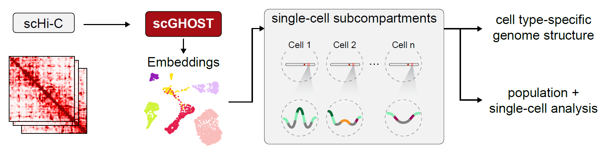

# Overview of scGHOST

scGHOST is an unsupervised single-cell subcompartment annotation method based on graph embedding with constrained random walk sampling.
scGHOST is designed to be run on a single-cell Hi-C (scHi-C) dataset which has undergone imputation by [Higashi](https://github.com/ma-compbio/Higashi) ([Zhang et al. 2022](https://www.nature.com/articles/s41587-021-01034-y)).
scGHOST assigns embeddings to genomic loci in the genomes of individual cells by viewing scHi-C as graphs whose vertices are genomic loci and edges are the contact frequencies among loci.
While scGHOST is developed for scHi-C data, it can also identify single-cell subcompartments in single-cell genome imaging data.

# Running scGHOST

## Input data

scGHOST uses the outputs from [Higashi](https://github.com/ma-compbio/Higashi) as its inputs.
Specifically, it requires the scHi-C imputations (hdf5 format), per-cell embeddings (numpy format), sparse raw scHi-C adjacency maps (numpy format), the scA/B scores (hdf5 format), and the label info file (pickle format) describing the cell types corresponding to each cell in the dataset.

## Installation

Before installing any Python packages, we strongly recommend using Anaconda (please refer to the [Anaconda](https://anaconda.org/) webpage for `conda` installation instructions) to create a python 3.10 environment using the following command:

`conda install --name scghost python=3.10`

After creating the environment, activate it using:

`conda activate scghost`

### Dependencies

#### Conda installations
- PyTorch (2.1.0) with CUDA (11.8)
- Scikit-learn (latest)
- h5py
#### Pip installations
- [cuML for CUDA 11.8](https://docs.rapids.ai/install#selector)
- [Thread-pool Controls](https://pypi.org/project/threadpoolctl/) (> 3)

Users can install scGHOST dependencies using the `conda` or `pip` commands following the specifications above.

Systems without a CUDA-capable GPU can also install scGHOST using the same dependencies and installing PyTorch for CPU only, but will have to modify the source code in `modules/clustering.py` to use `SKMeans` instead of `KMeans` under the `scghost_clustering_reworked` function. We may add a flag in the config file to run CPU only instead, but from our experience running scGHOST on the CPU only takes far longer than on a GPU and is not recommended.

## Hardware Requirements

scGHOST can use up to 40 GB of memory for a single-cell dataset of 4,238 cells.
Considering operating system overhead, we recommend running scGHOST on a machine with at least 64 GB of memory to avoid poor performance or out-of-memory errors at runtime.

scGHOST was developed on a system with a 12-core 12th generation Intel CPU, an Nvidia RTX 3090 GPU with 24GB of VRAM, and 64GB of system memory. With GPU caching enabled, scGHOST uses a maximum of 15 GB of VRAM on the PFC dataset. With GPU caching disabled, VRAM becomes less of a limiting factor and scGHOST should run on any CUDA-capable GPU.

## Usage

Users can run scGHOST using the following command:

`python scghost.py --config <configuration.json>`

Sample JSON config files for scGHOST have been provided.

`configuration` is the filepath to a custom configuration file adhering to the JSON format for scGHOST. By default, scGHOST uses the included config.json file, which can be modified to the user's specifications.

**Note**: users may run into a `RuntimeWarning` after the clustering step. This is normal behavior and should not affect the accuracy of results.

## Runtime
scGHOST was run on a machine with a 12-core 12th generation Intel CPU and Nvidia RTX 3090 24GB GPU.
From scratch, scGHOST takes about 2 hours to run on the sciHi-C GM12878 dataset and about 4 hours to run on the human prefrontal cortex dataset.

## Configuration file

- `schic_directory` : the directory containing Higashi-imputed single-cell Hi-C maps.
- `label_info` : `label_info.pickle` file following the [format in Higashi](https://github.com/ma-compbio/Higashi/wiki/Input-Files).
  - `path` : the file path of the `label_info.pickle` file
  - `cell_type_key` : the key in `label_info.pickle` with a list of the cell types in the dataset
- `data_directory` : the output directory of scGHOST
- `chromosomes` : the list of chromosomes to apply scGHOST to. default: autosomes
- `chrom_sizes` : file path to the chromosome sizes file. default: `data/hg38.chrom.sizes`
- `chrom_indices` : file path to chrom indices if previously computed. Development flag to save time over multiple runs on the same dataset. Default: `null`
- `embeddings_path` : file path to the Higashi embeddings `.npy` file for each cell in the dataset
- `higashi_scab_path` : file path to Higashi scA/B scores `.h5` file
- `cell_type` : the cell type in the dataset to apply scGHOST on; use `null` to apply scGHOST to all cell types in the dataset. default: `null`
- `random_walk` : random walk parameters
  - `num_walks` : number of random walks per iteration. default: 50
  - `ignore_top` : the top and bottom percentile to be ignored, to remove extreme values in the input matrix. default: 0.02
  - `top_percentile` : the top percentiles within which random walks are performed. default: 0.25
- `eps` : small float value to prevent dividing by zero in some functions. default: 1e-8
- `num_clusters` : number of clusters to partition chromosomes into
- `neighbor_contacts` : determine whether to use the average of nearest neighbor contacts as the target label during node embedding.
- `nearest_neighbor_override` : use a custom numpy array to define nearest neighbors. The format should be an `N x (k+1)` array with `N` denoting the number of cells in the dataset and `k` denoting the number of nearest neighbors. Row `i` in the array should contain entries denoting which cells are the nearest neighbors of cell `i`.
- `cluster_gpu_caching` : toggle caching chromosome embeddings on the GPU prior to clustering to reduce CPU overhead converting embedding vectors to cuda variables. We recomend disabling this if your GPU memory is less than 16 GB.
- `gpu_uniques` : determine whether to use the GPU to compute unique random walk samples. On machines with higher CPU core counts, CPU processing may be faster than GPU processing.
- `kmeans_init` : the `n_init` parameter in scikit-learn/cuML's `KMeans`. We set this value at a default of 1 to reduce clustering runtime.

## Tutorials

Please follow our tutorial notebooks in the root directory for examples on how to run scGHOST with and without first running Higashi. For a sample run of scGHOST, users can download the smaller WTC-11 dataset [here](http://genome.compbio.cs.cmu.edu:8008/~kxiong/data/scghost/wtc11/). After downloading the sample data, please change the `sample_configs/config_wtc.json` configuration file accordingly to point to the correct paths and run the following command:

`python scghost.py --config sample_configs/config_wtc.json`

## Contact
Please email jianma@cs.cmu.edu or raise an issue in the github repository with any questions about installation or usage.
